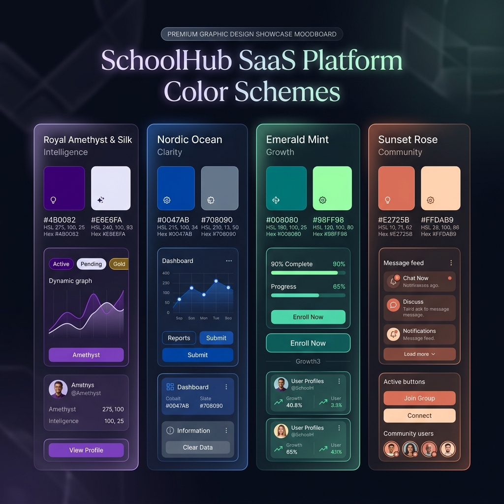
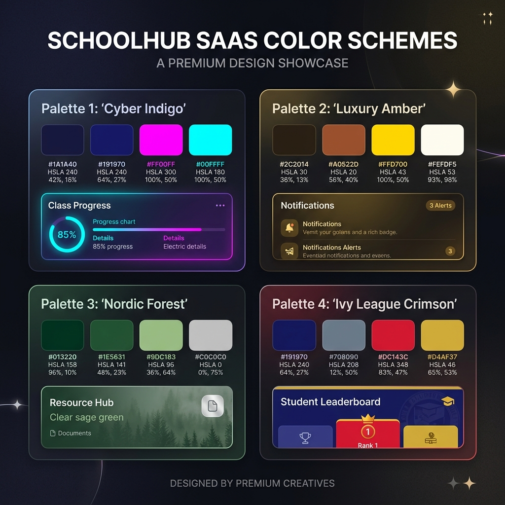
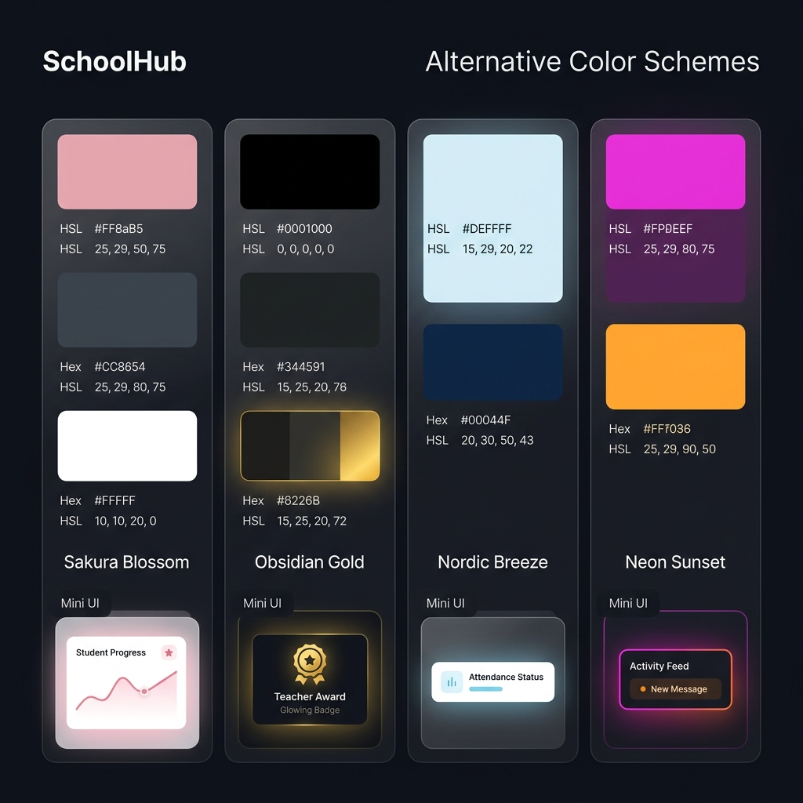
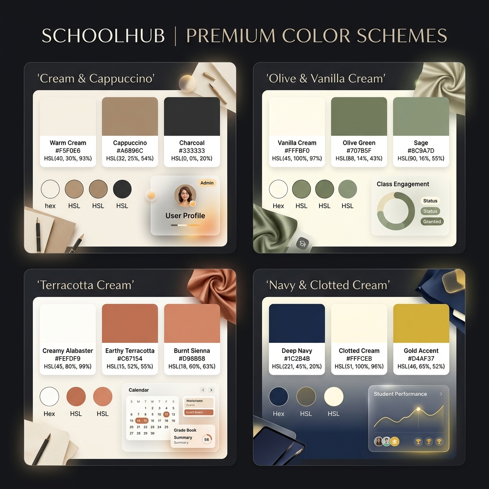

# Chartes Graphiques Curées pour SchoolHub

Voici une proposition complète de **16 chartes de couleurs modernes**, conçues pour sublimer l'expérience visuelle de votre plateforme SaaS **SchoolHub**. Chaque palette a été pensée pour s'intégrer harmonieusement dans les modes sombre et clair de l'application.

---

## 🎨 Volume 1 : Conceptions Initiales



### 💜 1. Royal Amethyst & Silk (Charte Active)
* **Description** : Violet électrique combiné à de l'indigo profond et des accents blanc soie. C'est l'identité active par défaut de l'application.
* **Psychologie** : Intelligence, modernité technologique, créativité et distinction. Parfait pour mettre en avant l'intégration des fonctionnalités d'IA.
* **Variables CSS Sombre** :
  ```css
  --primary: 263.4 70% 50.4%; /* Améthyste */
  --accent: 242 73% 58%;      /* Indigo */
  ```
* **Variables CSS Clair** :
  ```css
  --primary: 262.1 83.3% 57.8%;
  --accent: 262.1 83.3% 57.8%;
  ```

### 💙 2. Nordic Ocean (Clarté Professionnelle)
* **Description** : Un camaïeu de bleu cobalt, bleu acier scandinave et blanc polaire. 
* **Psychologie** : Clarté, fiabilité académique, calme et rigueur. C'est le standard de confiance de l'éducation nationale réinventé.
* **Variables CSS Sombre** :
  ```css
  --primary: 217.2 91.2% 59.8%; /* Cobalt */
  --accent: 199 89% 48%;       /* Cyan Arctique */
  ```
* **Variables CSS Clair** :
  ```css
  --primary: 221.2 83.2% 53.3%;
  --accent: 199 89% 48%;
  ```

### 💚 3. Emerald Mint (Croissance & Nature)
* **Description** : Un mélange frais de vert émeraude intense, de menthe claire et de nuances de gris sapin.
* **Psychologie** : Croissance personnelle, fraîcheur, dynamisme et sérénité écologique.
* **Variables CSS Sombre** :
  ```css
  --primary: 142.1 70.6% 45.3%; /* Émeraude */
  --accent: 168 84% 78%;       /* Menthe */
  ```
* **Variables CSS Clair** :
  ```css
  --primary: 142.1 76.2% 36.3%;
  --accent: 168 84% 78%;
  ```

### 🧡 4. Sunset Rose (Communauté & Accueil)
* **Description** : Des nuances chaleureuses de terre cuite (terracotta), de pêche douce et d'accents aubergine.
* **Psychologie** : Bienveillance familiale, accueil, harmonie communautaire et proximité. Excellente pour un tableau de bord à destination des parents.
* **Variables CSS Sombre** :
  ```css
  --primary: 18 84% 56%;  /* Terracotta */
  --accent: 38 92% 50%;    /* Pêche */
  ```
* **Variables CSS Clair** :
  ```css
  --primary: 12 76% 45%;
  --accent: 38 92% 50%;
  ```

---

## 🎨 Volume 2 : Alternatives & Exclusivités



### 💖 5. Cyber Indigo (Vibrant & Futuriste)
* **Description** : Un mélange ultra-moderne d'indigo cybernétique, de magenta électrique et d'accents bleu cyan néon.
* **Psychologie** : Innovation de pointe, énergie créative, design disruptif. Parfait pour cibler une audience jeune et adepte de technologies innovantes.
* **Variables CSS Sombre** :
  ```css
  --primary: 275 80% 56%;  /* Cyber Purple */
  --accent: 185 90% 48%;   /* Neon Cyan */
  ```
* **Variables CSS Clair** :
  ```css
  --primary: 275 80% 50%;
  --accent: 185 90% 48%;
  ```

### 💛 6. Luxury Amber (Élégance Académique)
* **Description** : Un contraste chaleureux entre un bronze profond et noble, de l'ambre dorée lumineuse et du crème soyeux.
* **Psychologie** : Excellence académique, prestige, confort d'apprentissage chaleureux, haut de gamme.
* **Variables CSS Sombre** :
  ```css
  --primary: 38 92% 50%;   /* Doré Ambre */
  --accent: 25 75% 45%;    /* Bronze */
  ```
* **Variables CSS Clair** :
  ```css
  --primary: 35 85% 40%;
  --accent: 25 75% 45%;
  ```

### 🌲 7. Nordic Forest (Minimalisme & Sérénité)
* **Description** : Un ton scandinave reposant mêlant du vert sapin profond, de la sauge douce et de l'argent mat.
* **Psychologie** : Concentration tranquille, écologie, harmonie d'esprit et fraîcheur naturelle.
* **Variables CSS Sombre** :
  ```css
  --primary: 155 45% 35%;  /* Vert Sapin */
  --accent: 145 35% 65%;   /* Sauge */
  ```
* **Variables CSS Clair** :
  ```css
  --primary: 155 45% 28%;
  --accent: 145 35% 65%;
  ```

### 🍒 8. Ivy League Crimson (Prestige Traditionnel)
* **Description** : Le contraste traditionnel des grandes universités anglo-saxonnes avec du bleu ardoise, du cramoisi éclatant (crimson) et du blanc d'ivoire.
* **Psychologie** : Richesse historique, héritage, sérieux institutionnel et leadership éducatif.
* **Variables CSS Sombre** :
  ```css
  --primary: 348 85% 45%;  /* Cramoisi */
  --accent: 215 50% 50%;   /* Bleu Ardoise */
  ```
* **Variables CSS Clair** :
  ```css
  --primary: 348 85% 38%;
  --accent: 215 50% 50%;
  ```

---

## 🎨 Volume 3 : Modernité & Fraîcheur



### 🌸 9. Sakura Blossom (Douceur & Harmonie)
* **Description** : Un contraste doux de rose cerisier (sakura), de gris ardoise anthracite et de blanc pur.
* **Psychologie** : Accompagnement bienveillant, calme, harmonie, pédagogie douce et encourageante.
* **Variables CSS Sombre** :
  ```css
  --primary: 338 85% 68%;  /* Sakura Pink */
  --accent: 220 15% 45%;   /* Gris Ardoise */
  ```
* **Variables CSS Clair** :
  ```css
  --primary: 338 85% 60%;
  --accent: 220 15% 45%;
  ```

### 🖤 10. Obsidian Gold (Luxe Contemporain)
* **Description** : Un fond noir d'obsidienne avec du gris anthracite très sombre et de somptueuses touches d'or jaune brillant.
* **Psychologie** : Prestige ultime, excellence élitiste, haut de gamme technologique, modernité sophistiquée.
* **Variables CSS Sombre** :
  ```css
  --primary: 48 95% 58%;   /* Or Brillant */
  --accent: 220 10% 20%;   /* Gris Anthracite */
  ```
* **Variables CSS Clair** :
  ```css
  --primary: 48 95% 45%;
  --accent: 220 10% 20%;
  ```

### ❄️ 11. Nordic Breeze (Pureté & Focus)
* **Description** : Un mélange ultra-propre de bleu glacier, blanc arctique et de bleu marine abysse.
* **Psychologie** : Concentration maximale, calme, limpidité d'esprit, sérénité nordique et rigueur.
* **Variables CSS Sombre** :
  ```css
  --primary: 198 85% 55%;  /* Bleu Glacier */
  --accent: 218 45% 20%;   /* Marine Abysse */
  ```
* **Variables CSS Clair** :
  ```css
  --primary: 198 85% 45%;
  --accent: 218 45% 20%;
  ```

### 🌅 12. Neon Sunset (Énergie & Synthwave)
* **Description** : Des gradients vibrants de magenta fluo avec du orange coucher de soleil néon, parfait pour un design jeune et ultra-interactif.
* **Psychologie** : Dynamisme, excitation créative, apprentissage gamifié, ultra-modernité.
* **Variables CSS Sombre** :
  ```css
  --primary: 332 95% 55%;  /* Magenta Fluo */
  --accent: 28 95% 55%;    /* Orange Néon */
  ```
* **Variables CSS Clair** :
  ```css
  --primary: 332 95% 48%;
  --accent: 28 95% 48%;
  ```

---

## 🎨 Volume 4 : Harmonies Crèmes & Chaleureuses



### ☕ 13. Cream & Cappuccino (Cosy & Confort)
* **Description** : Un ton crème très chaud et accueillant allié à un brun cappuccino doux et un anthracite léger.
* **Psychologie** : Confort d'apprentissage, cocon bienveillant, calme, concentration paisible et élégance.
* **Variables CSS Sombre** :
  ```css
  --primary: 34 85% 48%;   /* Cappuccino */
  --accent: 42 60% 88%;    /* Crème */
  ```
* **Variables CSS Clair** :
  ```css
  --primary: 34 85% 40%;
  --accent: 42 60% 88%;
  ```

### 🥑 14. Olive & Vanilla Cream (Naturel & Équilibre)
* **Description** : Du vert olive organique et texturé combiné avec une crème de vanille veloutée et du gris ardoise.
* **Psychologie** : Croissance saine, nature, calme intérieur, équilibre et maturité intellectuelle.
* **Variables CSS Sombre** :
  ```css
  --primary: 82 45% 40%;   /* Vert Olive */
  --accent: 45 70% 90%;    /* Crème Vanille */
  ```
* **Variables CSS Clair** :
  ```css
  --primary: 82 45% 32%;
  --accent: 45 70% 90%;
  ```

### 🧱 15. Terracotta Cream (Chaleur Rustique)
* **Description** : Un mélange chaleureux de rouge brique terracotta, d'albâtre crémeux et de sable chaud.
* **Psychologie** : Convivialité parent-école, accueil communautaire, énergie naturelle et bienveillance humaine.
* **Variables CSS Sombre** :
  ```css
  --primary: 16 80% 50%;   /* Terracotta */
  --accent: 33 65% 92%;    /* Albâtre */
  ```
* **Variables CSS Clair** :
  ```css
  --primary: 16 80% 42%;
  --accent: 33 65% 92%;
  ```

### ⚓ 16. Navy & Clotted Cream (Prestige Maritime)
* **Description** : Un bleu marine royal et profond contrasté avec du blanc crème onctueux (clotted cream) et des touches dorées dorures.
* **Psychologie** : Haut standard d'excellence académique, leadership, autorité bienveillante, prestige institutionnel.
* **Variables CSS Sombre** :
  ```css
  --primary: 224 85% 30%;  /* Bleu Marine */
  --accent: 44 75% 93%;    /* Crème Onctueux */
  ```
* **Variables CSS Clair** :
  ```css
  --primary: 224 85% 22%;
  --accent: 44 75% 93%;
  ```

---

> [!TIP]
> **Comment changer la palette ?**
> Il suffit de remplacer les variables `--primary` et `--accent` dans votre fichier [globals.css](src/app/globals.css) avec les valeurs HSL présentées ci-dessus. Tout le système de badges, de bordures IA et de graphiques s'ajustera automatiquement en temps réel !
