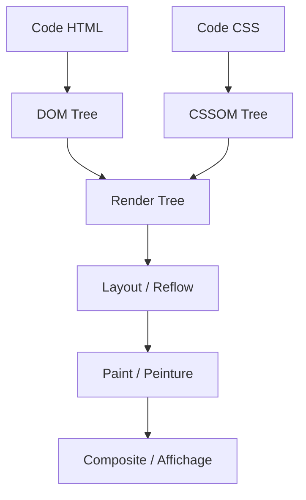

# ⚡ Apprendre les Performances Web : Le Guide Ultime de l'Intégration & du Rendu

Bienvenue dans ce guide complet dédié à l'optimisation des performances web. Que vous soyez développeur frontend, architecte web ou étudiant, comprendre comment une page est chargée, analysée et affichée par le navigateur est la clé pour concevoir des expériences utilisateur fluides, rapides et hautement convertissantes.

---

## 🚀 1. Pourquoi la Performance Web est Cruciale ?

La performance web n'est pas qu'une question de confort technique ; c'est un pilier fondamental de l'expérience utilisateur (UX) et du succès commercial d'une plateforme.

* **Impact sur la Conversion & la Rétention** : Les études de Google montrent que si le temps de chargement d'une page passe de 1 à 3 secondes, la probabilité de rebond augmente de **32%**. À 5 secondes, elle augmente de **90%**.
* **SEO (Search Engine Optimization)** : Depuis le déploiement de l'algorithme *Page Experience* de Google, les performances (via les *Core Web Vitals*) sont un critère direct de positionnement dans les résultats de recherche.
* **Accessibilité et Éco-conception** : Un site performant consomme moins de données mobiles et de batterie, ce qui le rend accessible aux terminaux modestes ou aux connexions lentes (3G), tout en réduisant l'empreinte carbone numérique.

---

## 🎨 2. Comment Bien Coder une Page Web pour qu'elle soit Performante

Bien coder commence par le respect de bonnes pratiques fondamentales dans la structure et la distribution de vos fichiers HTML, CSS et JavaScript.

### A. La Règle d'Or : "CSS en haut, JS en bas"
* **Le CSS en haut (`<head>`)** : Le navigateur a besoin du CSS pour construire l'arbre de rendu graphique. Placer vos feuilles de style dans le `<head>` évite le phénomène désagréable de **FOUC** (*Flash of Unstyled Content*).
* **Le JS en bas (ou avec attributs)** : Le JavaScript bloque par défaut l'analyse HTML (*HTML Parsing*). Placez vos balises `<script>` juste avant la fermeture du `</body>`, ou utilisez les attributs modernes `defer` ou `async`.

### B. Maîtriser `async` vs `defer`
```html
<!-- Bloquant : interrompt le parsing HTML pour charger et exécuter le script -->
<script src="script.js"></script>

<!-- Async : charge en parallèle, exécute dès qu'il est prêt (bloque le parsing pendant l'exécution) -->
<script async src="script.js"></script>

<!-- Defer (Recommandé) : charge en parallèle, exécute uniquement APRÈS la fin du parsing HTML -->
<script defer src="script.js"></script>
```

### C. Réduire le HTML et Éviter la "Surchargement de DOM" (DOM Deep)
Un arbre DOM trop profond (par exemple, 15 niveaux de `div` imbriquées inutiles) ralentit la vitesse d'analyse et consomme énormément de mémoire.
* Utilisez des balises sémantiques HTML5 (`<header>`, `<main>`, `<article>`, `<footer>`) qui structurent le document sans ajouter d'imbrications superflues.
* Limitez le nombre total de nœuds DOM (idéalement sous les **1500 nœuds** par page).

---

## 🗺️ 3. Le Critical Rendering Path (Chemin Critique du Rendu)

Le **Critical Rendering Path (CRP)** désigne la suite d'étapes par lesquelles passe le navigateur pour convertir le code HTML, CSS et JavaScript en pixels physiques sur l'écran.

### Les 6 Étapes Clés
1. **DOM (Document Object Model)** : Le navigateur analyse le HTML et construit l'arbre des balises.
2. **CSSOM (CSS Object Model)** : Le navigateur analyse le CSS et construit l'arbre des styles applicables.
3. **Render Tree (Arbre de Rendu)** : Combinaison du DOM et du CSSOM. Il ne contient que les éléments visibles (les éléments avec `display: none` en sont exclus, contrairement à `visibility: hidden`).
4. **Layout (Mise en page)** : Calcul de la géométrie de chaque élément (position exacte et taille en pixels sur l'écran). C'est ici que se produit le **Reflow**.
5. **Paint (Peinture)** : Remplissage des pixels (couleurs, bordures, ombres, texte).
6. **Composite (Composition)** : Superposition des différentes couches (layers) créées par le navigateur (ex. éléments en `position: fixed` ou animés avec `transform`) pour afficher l'image finale.

### Visualisation du CRP



> [!TIP]
> **Optimisation du CRP** : 
> * Minimisez le nombre de ressources CSS et JS bloquantes.
> * Intégrez le "Critical CSS" (le CSS nécessaire pour afficher le haut de la page/au-dessus de la ligne de flottaison) directement en ligne (`<style>`) dans le HTML, et chargez le reste de manière asynchrone.

---

## 📊 4. Les Trois Grandes Métriques "Core Web Vitals"

Définies par Google, les **Core Web Vitals** (Signaux Web Essentiels) mesurent la qualité de l'expérience utilisateur sur trois aspects clés : le chargement, l'interactivité et la stabilité visuelle.

| Métrique | Nom Complet | Ce qu'elle mesure | Cible Excellente | Comment l'améliorer |
| :--- | :--- | :--- | :--- | :--- |
| **LCP** | *Largest Contentful Paint* | **Vitesse de chargement perçue** : Temps requis pour afficher le plus grand élément visible (image de héros, grand pavé de texte). | **< 2.5 secondes** | Optimiser les images, utiliser un CDN, précharger les ressources critiques (`<link rel="preload">`). |
| **INP** | *Interaction to Next Paint* | **Interactivité / Réactivité** : Temps nécessaire pour que le navigateur mette à jour visuellement la page après qu'un utilisateur a cliqué ou tapé. | **< 200 millisecondes** | Alléger les scripts JS, découper les tâches JS longues (Long Tasks), optimiser les gestionnaires d'événements. |
| **CLS** | *Cumulative Layout Shift* | **Stabilité Visuelle** : Somme des déplacements inattendus d'éléments sur l'écran pendant le chargement. | **< 0.1** | Réserver de l'espace pour les images et pubs (attributs `width` et `height`), éviter d'insérer du contenu dynamique au-dessus du contenu existant sans transition. |

> [!IMPORTANT]
> **Note Historique** : L'**INP** (Interaction to Next Paint) a officiellement remplacé le **FID** (First Input Delay) en mars 2024. Contrairement au FID qui ne mesurait que le délai de la *première* interaction, l'INP évalue la réactivité globale de la page tout au long de la session utilisateur.

---

## 🖼️ 5. Les Images Responsives

Envoyer une photo de 4000px de large pesant 5 Mo à un smartphone doté d'un écran de 400px de large est un désastre de performance. Les images responsives permettent d'adapter la ressource servie au terminal de l'utilisateur.

### A. L'attribut `srcset` et `sizes` (Changement de résolution)
Permet de proposer plusieurs résolutions d'une même image pour que le navigateur choisisse la plus adaptée.

```html

```
* `400w`, `800w`, `1200w` indiquent la largeur réelle de chaque fichier image en pixels.
* `sizes` indique au navigateur quelle sera la largeur d'affichage théorique de l'image selon la taille du viewport CSS.

### B. La balise `<picture>` (Direction artistique et formats alternatifs)
Idéal pour servir des formats d'image modernes tout en garantissant un support pour les anciens navigateurs.

```html
<picture>
  <!-- Format moderne compressé en priorité -->
  <source srcset="photo.avif" type="image/avif">
  <source srcset="photo.webp" type="image/webp">
  <!-- Fallback universel -->
  
</picture>
```

---

## 🌐 6. L'Intérêt d'utiliser un CDN (Content Delivery Network)

Un **CDN** est un réseau mondial de serveurs connectés qui stockent une copie de vos fichiers statiques (images, CSS, JS, polices).

```
[Utilisateur à Tokyo] --------(Latence faible)--------> [Serveur CDN local (Tokyo)]
      |                                                        | (Réseau privé ultra-rapide)
      v                                                        v
[Utilisateur à Paris] --------(Latence élevée)-------> [Serveur d'Origine (Paris)]
```

### Les Avantages Majeurs
1. **Réduction de la Latence (TTFB - Time to First Byte)** : Vos fichiers sont servis depuis le serveur géographique le plus proche de l'utilisateur (les serveurs "Edge").
2. **Soulagement du Serveur d'Origine** : Les requêtes pour les fichiers statiques n'atteignent plus votre serveur principal, réduisant vos coûts d'infrastructure et le risque de panne.
3. **Mise en cache intelligente** : Les CDN gèrent de manière extrêmement efficace les en-têtes HTTP de cache (`Cache-Control`, `ETag`).
4. **Sécurité accrue** : La plupart des CDN intègrent des pare-feux applicatifs (WAF) et une protection native contre les attaques par déni de service (DDoS).

---

## 💤 7. Le Lazy Loading (Chargement Différé)

Le **Lazy Loading** consiste à repousser le chargement des ressources non critiques (généralement situées en dessous de la ligne de flottaison / *below-the-fold*) jusqu'au moment où l'utilisateur en a besoin (en faisant défiler la page).

### A. Lazy loading natif (Recommandé)
Aujourd'hui supporté par l'immense majorité des navigateurs modernes, il suffit d'ajouter l'attribut `loading="lazy"`.

```html

<iframe src="https://maps.google.com/..." loading="lazy"></iframe>
```

### B. L'API JavaScript `IntersectionObserver`
Pour des cas de figures complexes ou des effets de transition personnalisés au défilement :

```javascript
const observer = new IntersectionObserver((entries, observer) => {
  entries.forEach(entry => {
    if (entry.isIntersecting) {
      const img = entry.target;
      img.src = img.dataset.src; // Remplace le placeholder par la vraie image
      img.removeAttribute('data-src');
      observer.unobserve(img); // Arrête d'observer une fois chargée
    }
  });
});

document.querySelectorAll('img[data-src]').forEach(img => observer.observe(img));
```

> [!WARNING]
> **Alerte LCP !** Ne mettez **jamais** de `loading="lazy"` sur les images situées au-dessus du pli (comme l'image principale d'un article ou la bannière d'accueil). Cela retarderait le chargement de cette image clé et détruirait votre score LCP. Au contraire, préchargez-les :
> `<link rel="preload" as="image" href="hero.webp">`

---

## 🎨 8. Les Différents Formats d'Image et les Performances

Le choix du bon format d'image peut réduire le poids d'une page de plus de 50%.

| Format | Type | Points Forts | Points Faibles | Cas d'Usage Idéal |
| :--- | :--- | :--- | :--- | :--- |
| **JPEG** | Matriciel | Excellent dégradé de couleurs, compatibilité universelle. | Compression destructrice, pas de transparence. | Photos complexes et colorées, fallback. |
| **PNG** | Matriciel | Compression sans perte, support complet de la transparence. | Fichiers lourds pour les photos. | Logos complexes, schémas, captures d'écran nécessitant de la transparence. |
| **SVG** | Vectoriel | Poids dérisoire, infiniment redimensionnable sans perte de qualité, modifiable en CSS/JS. | Inadapté aux photos ou images complexes à milliers de couleurs. | Logos, icônes, illustrations simples. |
| **WebP** | Matriciel (moderne) | Poids 25% à 30% plus léger que le JPEG/PNG à qualité égale, gère la transparence et l'animation. | Légèrement moins performant que l'AVIF. | Format standard pour le web moderne. |
| **AVIF** | Matriciel (futur) | Compression incroyable (jusqu'à 50% plus léger que le JPEG), précision des détails et couleurs. | Temps d'encodage plus long, support absent sur les très vieux navigateurs. | Le choix ultime pour les photos web de haute qualité aujourd'hui. |

---

## 🔄 9. Le Reflow et le Repaint

Lorsqu'un navigateur affiche une page, toute modification dynamique via JavaScript ou CSS peut forcer le navigateur à recalculer la structure de la page.

* **Reflow (ou Layout)** : Le navigateur recalcule la position et la géométrie des éléments de la page. C'est une opération extrêmement gourmande en ressources CPU.
* **Repaint** : Le navigateur redessine les éléments sur l'écran (sans changer leur disposition). Moins coûteux que le Reflow, mais doit tout de même être minimisé.

### Qu'est-ce qui déclenche un Reflow ?
* Redimensionner la fenêtre du navigateur.
* Modifier la police d'écriture ou la taille du texte.
* Ajouter, supprimer ou modifier des classes ou styles affectant la géométrie (`width`, `height`, `margin`, `padding`, `border`, `display`, `float`).
* Lire des propriétés géométriques en JavaScript (comme `offsetWidth`, `clientHeight`, `getBoundingClientRect()`), car cela force le navigateur à recalculer immédiatement la mise en page pour donner la valeur exacte (phénomène de *Layout Thrashing*).

### Comment optimiser et éviter le Reflow ?
1. **Privilégier la composition (GPU)** : Pour les animations, utilisez uniquement les propriétés CSS `transform` (pour déplacer, zoomer, pivoter) et `opacity`. Elles sont gérées directement par la carte graphique (GPU) et ne provoquent **ni Reflow ni Repaint**.
2. **Utiliser des Fragments de DOM** : Si vous devez ajouter plusieurs éléments au DOM en JavaScript, utilisez un `DocumentFragment` pour effectuer toutes les insertions en mémoire hors ligne, puis insérez le fragment en une seule fois.
3. **Mettre à jour les classes hors-ligne** : Cachez l'élément (`display: none`), appliquez 10 modifications de styles, puis réaffichez-le. Cela ne génère que 2 Reflows au lieu de 10.

---

## 📦 10. L'Intérêt des Bundlers (Vite, Webpack, Rollup)

À l'ère des frameworks modernes (React, Next.js, Vue), le code source d'une application est découpé en centaines de petits fichiers et composants. Un **Bundler** regroupe, transforme et optimise ces fichiers pour les rendre exploitables de façon ultra-performante par le navigateur.

### Les Fonctionnalités Majeures pour la Performance

* **Le Bundling / Concaténation** : Regroupe des centaines de fichiers JS/CSS en un nombre restreint de fichiers, limitant drastiquement les requêtes HTTP requises pour charger le site.
* **Le Tree Shaking (Élimination du code mort)** : Analyse le code d'importation et supprime automatiquement les fonctions ou bibliothèques importées mais jamais utilisées dans votre code final.
* **La Minification et Compression** : Supprime les espaces, commentaires et renomme les variables avec des noms ultra-courts (ex: `function calculerTotal(prixArticles)` devient `function a(b)`).
* **Le Code Splitting (Découpage de code)** : Découpe automatiquement votre application en petits paquets (chunks) chargés à la demande. Par exemple, le JavaScript de la page `/admin` ne sera pas chargé si l'utilisateur consulte uniquement la page `/accueil`.

---

## 🤖 11. Utiliser des IAs pour Auditer ses Pages et Trouver des Solutions

Les intelligences artificielles génératives (LLM) sont des alliées fantastiques pour accélérer le diagnostic de performance et obtenir des solutions prêtes à l'emploi.

### Comment collaborer efficacement avec une IA ?

#### 1. Analyser les rapports d'audit (Lighthouse / PageSpeed)
Copiez-collez les résultats d'un audit de performance dans votre invite (prompt) et demandez-lui un plan d'action hiérarchisé.
> **Exemple de prompt** : *"Voici une partie de mon rapport Google Lighthouse indiquant un LCP à 4.2 secondes et du render-blocking JavaScript. Voici mon fichier `index.html`. Comment puis-je réorganiser mes balises et optimiser le CRP pour repasser sous les 2.5 secondes ?"*

#### 2. Détecter et corriger les re-renders inutiles (React)
Les IA excellent dans la détection des boucles de rendu et l'implémentation de la mémoïsation.
> **Exemple de prompt** : *"Ce composant React subit des lenteurs lors de la saisie utilisateur. Peux-tu analyser si des calculs lourds provoquent des re-renders et me proposer une refactorisation avec `useMemo`, `useCallback` ou `React.memo` ?"*

#### 3. Convertir des animations géométriques coûteuses en CSS composite
> **Exemple de prompt** : *"J'ai cette animation CSS qui modifie `left` et `width` au survol, ce qui provoque des saccades (Reflows). Peux-tu la réécrire en utilisant uniquement `transform` et `translate` pour déléguer le travail au GPU ?"*

---

## 🏁 Conclusion

Optimiser les performances web est un travail continu qui demande de la rigueur et de la méthode. En appliquant les principes du **Critical Rendering Path**, en configurant des **images responsives**, en tirant profit d'un **CDN** et en surveillant de près vos **Core Web Vitals**, vous offrirez à vos utilisateurs une expérience à la fois rapide, mémorable et éco-responsable.

*À vous de jouer : lancez un audit Lighthouse sur votre projet et commencez par éliminer les éléments bloquant le rendu !*
